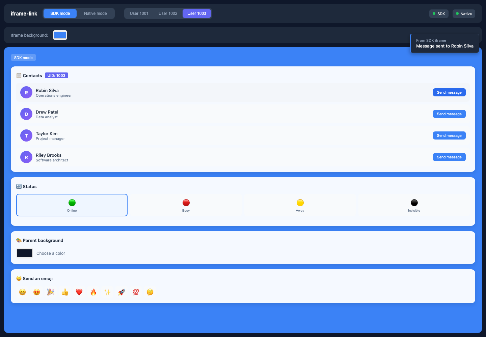

# iframe-link

Simple communication between an iframe and its parent.

A browser library for JavaScript and TypeScript with Promise-based, bidirectional remote procedure calls (RPC) and event messaging over `window.postMessage`.

English · [简体中文](docs/README.zh-CN.md) · [日本語](docs/README.ja.md)

## Why

`postMessage` moves messages, but it does not provide request IDs, Promise resolution, event routing, or a reliable way to know when the other side is ready. Rebuilding that layer for every iframe is repetitive, and Origin checks are easy to miss.

This SDK turns the parent and iframe into two ends of one small channel: expose methods, await remote calls, emit events, and handle load-order races with a READY/ACK handshake.



## Install

Install [`iframe-link`](https://www.npmjs.com/package/iframe-link) from npm:

```bash
pnpm add iframe-link
# npm install iframe-link
# yarn add iframe-link
```

## Quick Start

### Parent

```ts
import { connectToIframe } from 'iframe-link'

type ChildApi = {
  getStatus(input: { userId: string }): Promise<{ online: boolean }>
}

const channel = connectToIframe<ChildApi>({
  iframe: '#profile-frame',
  origin: 'https://child.example.com',
  methods: {
    getTheme: async () => ({ accent: '#3b82f6' })
  }
})

channel.on('STATUS_CHANGED', console.log)

const child = await channel.promise
await child.getStatus({ userId: '42' })
```

### Child

```ts
import { connectToParent } from 'iframe-link'

type ParentApi = {
  getTheme(): Promise<{ accent: string }>
}

const channel = connectToParent<ParentApi>({
  allowedOrigins: ['https://app.example.com'],
  methods: {
    getStatus: async ({ userId }) => ({ userId, online: true })
  }
})

const parent = await channel.promise
await parent.getTheme()

channel.emit('STATUS_CHANGED', { online: true })
```

Call `channel.destroy()` when the iframe is removed.

## API

`connectToIframe({ iframe, origin, methods })` connects a parent page to an iframe. `connectToParent({ allowedOrigins, methods })` connects an iframe to its parent page.

| Member | Purpose |
| --- | --- |
| `promise` | Resolves to the remote method proxy after the handshake. |
| `on(type, handler)` | Subscribes to an event. |
| `off(type, handler)` | Unsubscribes from an event. |
| `emit(type, data?)` | Emits an event to the other side. |
| `destroy()` | Removes listeners and rejects pending RPC calls. |

`methods` exposes local functions to the other side.

## Safety & Limits

- Configure exact trusted Origins in production; do not configure a wildcard Origin.
- The parent validates the configured Origin and iframe source. The child validates `allowedOrigins` and requires `event.source === window.parent`.
- Before its parent Origin is confirmed, the child sends only READY messages, using `targetOrigin: '*'`. Await `channel.promise` before calling `emit()`; events emitted by the child before it is ready are ignored.
- Message values must be JSON-serializable. Each RPC accepts one optional payload.
- Timeout and cancellation are not built in. Without an ACK after five READY attempts, `promise` stays pending.
- An SDK-less child can call methods exposed by an SDK parent, but it does not complete the SDK handshake.

## Contributing

See the [contributing guide](https://github.com/yuukiLike/iframe-link/blob/main/docs/CONTRIBUTING.md) for local development and testing.

## License

[MIT](LICENSE) · [Third-party notices](docs/THIRD_PARTY_NOTICES.md)
