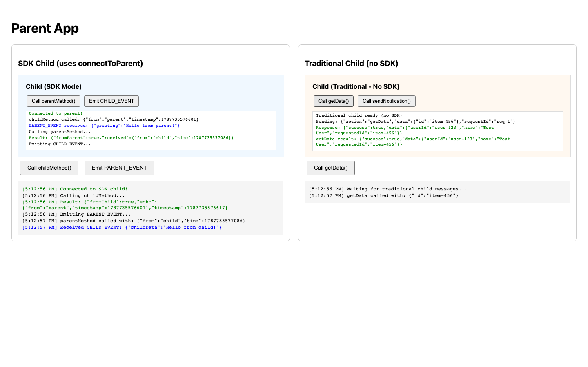

# iframe-rpc-kit

基于 `window.postMessage`，在 iframe 与父页面之间提供 Promise 风格的双向 RPC 与事件通信。

[English](README.md) · 简体中文 · [日本語](README.ja.md)


## 为什么使用

- 父子双方都能像调用本地异步函数一样调用远程方法。
- 通过 `on`、`off`、`emit` 收发事件。
- 用 READY/ACK 握手与自动重试处理父子页面加载顺序不同的问题。
- 父页面接收消息时，同时校验预期 Origin 与目标 iframe。
- 原生子页面无需安装此包，也能调用 SDK 父页面暴露的方法。
- 同时提供 ESM、CommonJS 与 TypeScript 类型声明。

## 安装

```bash
pnpm add iframe-rpc-kit
# npm install iframe-rpc-kit
# yarn add iframe-rpc-kit
```

## 快速开始

父页面：

```ts
import { connectToIframe } from 'iframe-rpc-kit'

type ChildApi = {
  getStatus(input: { userId: string }): Promise<{ online: boolean }>
}

const channel = connectToIframe<ChildApi>({
  iframe: '#profile-frame',
  origin: 'https://child.example.com',
  methods: {
    getTheme: async () => ({ accent: '#3b82f6' })
  }
})

const child = await channel.promise
const status = await child.getStatus({ userId: '42' })

channel.on('STATUS_CHANGED', console.log)
```

子页面：

```ts
import { connectToParent } from 'iframe-rpc-kit'

type ParentApi = {
  getTheme(): Promise<{ accent: string }>
}

const channel = connectToParent<ParentApi>({
  allowedOrigins: ['https://app.example.com'],
  methods: {
    getStatus: async ({ userId }) => ({ userId, online: true })
  }
})

const parent = await channel.promise
const theme = await parent.getTheme()

channel.emit('STATUS_CHANGED', { online: true })
```

当 iframe 或其所属组件被移除时，请调用 `channel.destroy()`。

## 原生子页面

使用 SDK 的父页面也能接收原生 `postMessage` 请求。子页面发送 `{ action, data, requestId }`，父页面以 `__NATIVE_RESPONSE__` 响应。



```js
const parentOrigin = 'https://app.example.com'
const requestId = crypto.randomUUID()

window.parent.postMessage(
  { action: 'getTheme', data: {}, requestId },
  parentOrigin
)

window.addEventListener('message', (event) => {
  if (event.origin !== parentOrigin || event.source !== window.parent) return

  const message = event.data
  if (message?.type === '__NATIVE_RESPONSE__' && message.requestId === requestId) {
    if (message.success) console.log(message.result)
    else console.error(message.error)
  }
})
```

这条兼容路径是“原生子页面 → SDK 父页面”，不会让 SDK 远程代理反向调用原生子页面。由于原生子页面不会发送 READY，父页面的 `channel.promise` 会一直保持 pending。

## 安全与限制

- 生产环境请使用明确可信的 Origin，不要使用 `'*'`。
- RPC 参数与返回值、事件数据及原生响应都必须可被 JSON 序列化；每次远程调用只接收一个可选参数。
- 父页面会同时校验配置的 Origin 与消息来源 iframe。
- 子页面会根据 `allowedOrigins` 校验 Origin；当前实现不会再单独要求 `event.source === window.parent`。
- 在尚未获知父页面 Origin 时，子页面会以 `targetOrigin: '*'` 发送 READY；接收消息时仍会使用 `allowedOrigins` 校验。
- 当前没有内置的 RPC 超时或取消机制。
- 子页面最多发送 5 次 READY；若一直未收到 ACK，`channel.promise` 会保持 pending，而不会自动 reject。

可通过 `debug: true` 启用调试日志；也可以设置 `localStorage.debug = 'iframe-rpc-kit:*'` 后刷新页面。

## API

| 函数 | 用途 |
| --- | --- |
| `connectToIframe(options)` | 让父页面连接指定 iframe。 |
| `connectToParent(options)` | 让 iframe 连接父页面。 |

两者都会返回：

| 成员 | 用途 |
| --- | --- |
| `promise` | 握手完成后，解析为远程方法代理。 |
| `on(type, handler)` | 监听事件。 |
| `off(type, handler)` | 移除事件监听。 |
| `emit(type, data?)` | 向另一端发送事件。 |
| `destroy()` | 移除监听，并拒绝仍在等待的 RPC。 |

## 开发

```bash
npm ci
npm test
npm run test:e2e
npm run build
```

## 许可证

[MIT](LICENSE)
