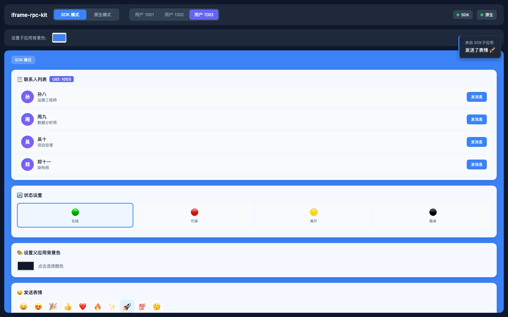

# iframe-rpc-kit

基于 `window.postMessage`，在 iframe 与父页面之间提供 Promise RPC 与事件通信。

[English](README.md) · 简体中文 · [日本語](README.ja.md)



Promise RPC · 事件通信 · 握手重试 · Origin 校验 · 无 SDK 子页面请求 · ESM / CJS / TypeScript

## 安装

```bash
pnpm add iframe-rpc-kit
# npm install iframe-rpc-kit
# yarn add iframe-rpc-kit
```

## 使用

父页面：

```ts
import { connectToIframe } from 'iframe-rpc-kit'

type ChildApi = {
  getStatus(input: { userId: string }): Promise<{ online: boolean }>
}

const channel = connectToIframe<ChildApi>({
  iframe: '#profile-frame',
  origin: 'https://child.example.com',
  methods: {
    getTheme: async () => ({ accent: '#3b82f6' })
  }
})

const child = await channel.promise
await child.getStatus({ userId: '42' })

channel.on('STATUS_CHANGED', console.log)
```

子页面：

```ts
import { connectToParent } from 'iframe-rpc-kit'

type ParentApi = {
  getTheme(): Promise<{ accent: string }>
}

const channel = connectToParent<ParentApi>({
  allowedOrigins: ['https://app.example.com'],
  methods: {
    getStatus: async ({ userId }) => ({ userId, online: true })
  }
})

const parent = await channel.promise
await parent.getTheme()

channel.emit('STATUS_CHANGED', { online: true })
```

`connectToIframe()` 和 `connectToParent()` 都会返回 `{ promise, on, off, emit, destroy }`。移除 iframe 时请调用 `destroy()`。

## 注意

- 生产环境请配置明确可信的 Origin，不要使用 `'*'`。
- 父页面会校验配置的 Origin 与来源 iframe；子页面通过 `allowedOrigins` 校验。READY 消息使用 `targetOrigin: '*'`。
- 消息内容必须可被 JSON 序列化；每次 RPC 只接收一个可选参数。
- 当前没有内置的 RPC 超时或取消机制。连续 5 次 READY 未收到 ACK 时，`promise` 会保持 pending。
- 未使用 SDK 的子页面仅支持“子页面 → SDK 父页面”；没有 READY 时，父页面的 `promise` 会保持 pending。

## 许可证

[MIT](LICENSE)
