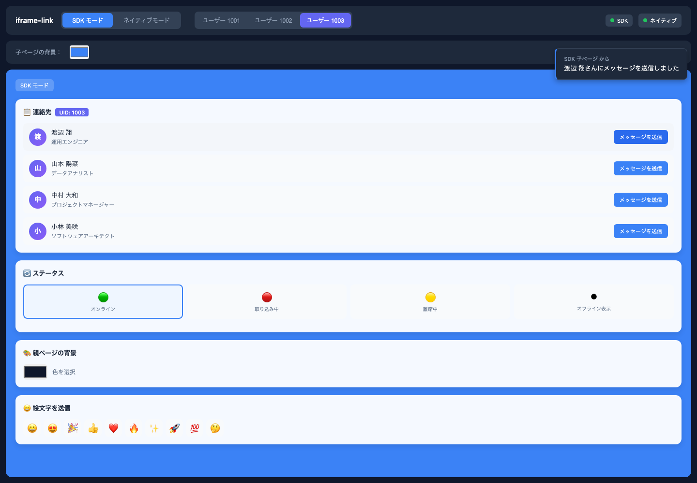

# iframe-link

iframe と親ページの通信をシンプルに。

JavaScript と TypeScript 向けのミニマルなブラウザー通信ライブラリです。`window.postMessage` を使い、Promise ベースの双方向 RPC（リモートプロシージャコール）とイベント通信を提供します。

[English](../README.md) · [简体中文](README.zh-CN.md) · 日本語

## 特長

`postMessage` はメッセージを送るだけで、リクエスト ID、Promise による応答、イベントの振り分け、相手側の準備完了を確実に確認する仕組みまでは提供しません。iframe ごとに同じ仕組みを作り直すのは手間がかかり、Origin 検証も見落としやすくなります。

この SDK は親ページと iframe を小さな双方向チャネルでつなぎます。メソッドの公開、リモート呼び出し、イベント送信に加え、READY/ACK ハンドシェイクで読み込み順の違いにも対応します。

設計の目標は、iframe 通信に集中した小さな API を保ち、明確な必要性がある場合にのみ抽象化や互換レイヤーを導入することです。



## インストール

npm の [`iframe-link`](https://www.npmjs.com/package/iframe-link) をインストールします。

```bash
pnpm add iframe-link
# npm install iframe-link
# yarn add iframe-link
```

## クイックスタート

### 親ページ

```ts
import { connectToIframe } from 'iframe-link'

type ChildApi = {
  getStatus(input: { userId: string }): Promise<{ online: boolean }>
}

const channel = connectToIframe<ChildApi>({
  iframe: '#profile-frame',
  origin: 'https://child.example.com',
  methods: {
    getTheme: async () => ({ accent: '#3b82f6' })
  }
})

channel.on('STATUS_CHANGED', console.log)

const child = await channel.promise
await child.getStatus({ userId: '42' })
```

### 子ページ

```ts
import { connectToParent } from 'iframe-link'

type ParentApi = {
  getTheme(): Promise<{ accent: string }>
}

const channel = connectToParent<ParentApi>({
  allowedOrigins: ['https://app.example.com'],
  methods: {
    getStatus: async ({ userId }) => ({ userId, online: true })
  }
})

const parent = await channel.promise
await parent.getTheme()

channel.emit('STATUS_CHANGED', { online: true })
```

iframe を削除するときは `channel.destroy()` を呼び出してください。

## API

`connectToIframe({ iframe, origin, methods })` は親ページから iframe へ接続し、`connectToParent({ allowedOrigins, methods })` は iframe から親ページへ接続します。

| メンバー | 用途 |
| --- | --- |
| `promise` | ハンドシェイク後、リモートメソッドのプロキシに解決されます。 |
| `on(type, handler)` | イベントを購読します。 |
| `off(type, handler)` | イベント購読を解除します。 |
| `emit(type, data?)` | 相手側へイベントを送信します。 |
| `destroy()` | リスナーを削除し、保留中の RPC を reject します。 |

`methods` で相手側にローカルメソッドを公開します。

## セキュリティと制限

- 本番環境では信頼できる Origin を明示し、ワイルドカードの Origin は設定しないでください。
- 親側は設定した Origin と送信元 iframe を検証します。子側は `allowedOrigins` を検証し、`event.source === window.parent` であることも確認します。
- 親ページの Origin が確認されるまでは、子側は READY のみを `targetOrigin: '*'` で送信します。`emit()` は `await channel.promise` の後に呼び出してください。子側が準備完了前に送信したイベントは無視されます。
- メッセージの値は JSON でシリアライズ可能である必要があります。各 RPC には、省略可能なペイロードを 1 つ渡せます。
- タイムアウトとキャンセルは内蔵していません。READY を 5 回送っても ACK が届かない場合、`promise` は pending のままです。
- SDK を使わない子ページから親側の公開メソッドを呼び出せますが、SDK のハンドシェイクは完了しません。

## コントリビューション

ローカル開発とテストについては、[貢献ガイド](https://github.com/yuukiLike/iframe-link/blob/main/docs/CONTRIBUTING.md)を参照してください。

## ライセンス

[MIT](../LICENSE) · [サードパーティの通知](THIRD_PARTY_NOTICES.md)
