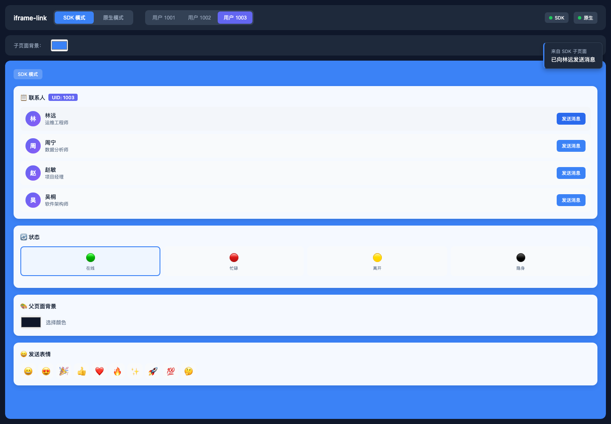

# iframe-link

让 iframe 与父页面之间的通信更简单。

面向 JavaScript 和 TypeScript 的极简浏览器通信库，基于 `window.postMessage`，提供 Promise 双向远程过程调用（RPC）与事件通信。

[English](../README.md) · 简体中文 · [日本語](README.ja.md)

## 为什么使用

`postMessage` 只负责传递消息，并不会处理请求标识、Promise 响应、事件分发，也无法可靠确认另一端何时就绪。每个 iframe 都重复实现这些逻辑既繁琐，也容易遗漏 Origin 校验。

这个 SDK 将父页面与 iframe 连接成一个轻量的双向通道：暴露方法、等待远程调用、发送事件，并通过 READY/ACK 握手处理加载顺序差异。

设计目标是保持 API 精简、专注于 iframe 通信，只在明确需求出现时引入抽象或兼容层。



## 安装

从 npm 安装 [`iframe-link`](https://www.npmjs.com/package/iframe-link)：

```bash
pnpm add iframe-link
# npm install iframe-link
# yarn add iframe-link
```

## 快速开始

### 父页面

```ts
import { connectToIframe } from 'iframe-link'

type ChildApi = {
  getStatus(input: { userId: string }): Promise<{ online: boolean }>
}

const channel = connectToIframe<ChildApi>({
  iframe: '#profile-frame',
  origin: 'https://child.example.com',
  methods: {
    getTheme: async () => ({ accent: '#3b82f6' })
  }
})

channel.on('STATUS_CHANGED', console.log)

const child = await channel.promise
await child.getStatus({ userId: '42' })
```

### 子页面

```ts
import { connectToParent } from 'iframe-link'

type ParentApi = {
  getTheme(): Promise<{ accent: string }>
}

const channel = connectToParent<ParentApi>({
  allowedOrigins: ['https://app.example.com'],
  methods: {
    getStatus: async ({ userId }) => ({ userId, online: true })
  }
})

const parent = await channel.promise
await parent.getTheme()

channel.emit('STATUS_CHANGED', { online: true })
```

移除 iframe 时，请调用 `channel.destroy()`。

## API

`connectToIframe({ iframe, origin, methods })` 让父页面连接 iframe，`connectToParent({ allowedOrigins, methods })` 让 iframe 连接父页面。

| 成员 | 用途 |
| --- | --- |
| `promise` | 握手完成后解析为远程方法代理。 |
| `on(type, handler)` | 监听事件。 |
| `off(type, handler)` | 移除事件监听。 |
| `emit(type, data?)` | 向另一端发送事件。 |
| `destroy()` | 移除监听，并拒绝仍在等待的 RPC。 |

`methods` 用于向另一端暴露本地方法。

## 安全与限制

- 生产环境请配置明确可信的 Origin，不要配置通配 Origin。
- 父页面会校验配置的 Origin 与来源 iframe；子页面会校验 `allowedOrigins`，并要求 `event.source === window.parent`。
- 确认父页面 Origin 之前，子页面只发送 READY 消息，使用 `targetOrigin: '*'`。请在 `await channel.promise` 后调用 `emit()`；子页面在就绪前发送的事件会被忽略。
- 消息内容必须可被 JSON 序列化；每次 RPC 只接收一个可选参数。
- 当前没有内置的超时或取消机制。连续 5 次 READY 未收到 ACK 时，`promise` 会保持 pending。
- 未使用 SDK 的子页面可以调用 SDK 父页面暴露的方法，但不会完成 SDK 握手。

## 贡献

本地开发与测试请参阅[贡献指南](https://github.com/yuukiLike/iframe-link/blob/main/docs/CONTRIBUTING.md)。

## 许可证

[MIT](../LICENSE) · [第三方声明](THIRD_PARTY_NOTICES.md)
