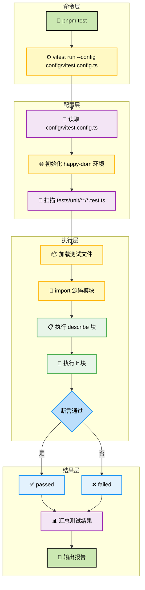
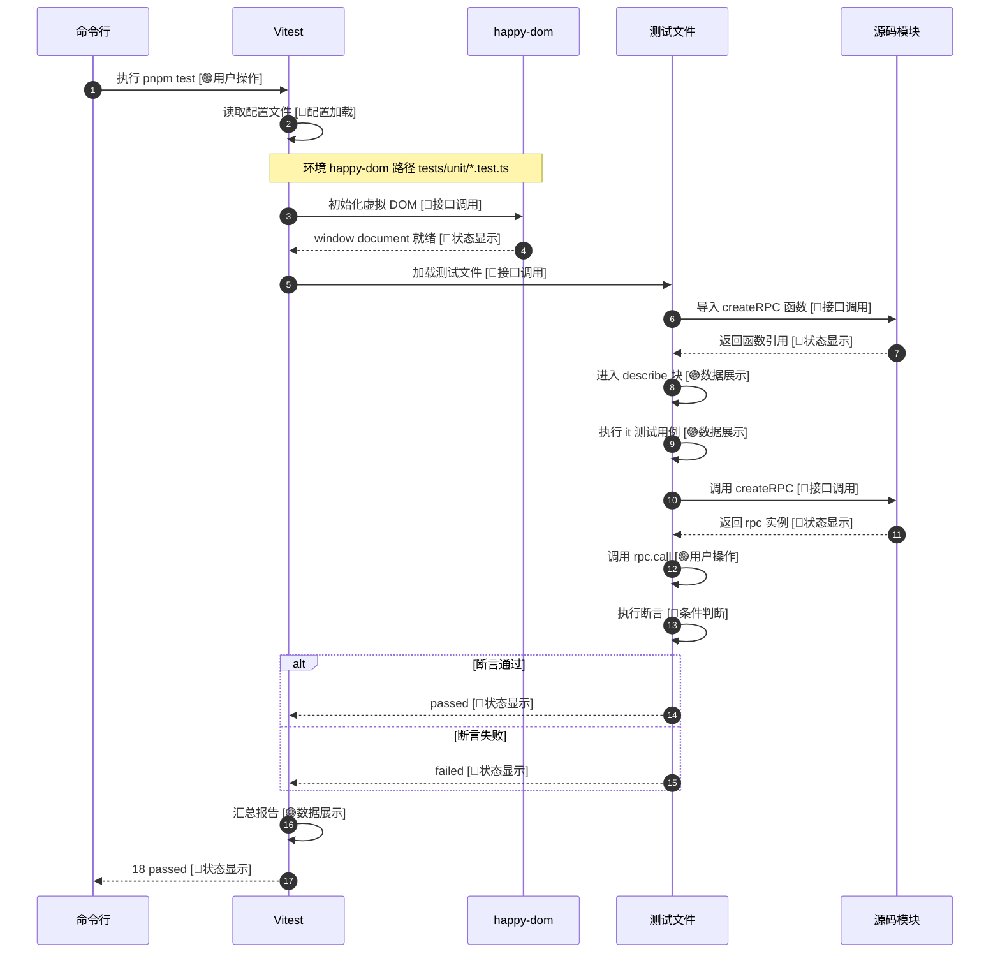
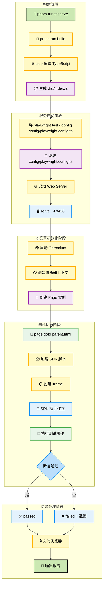
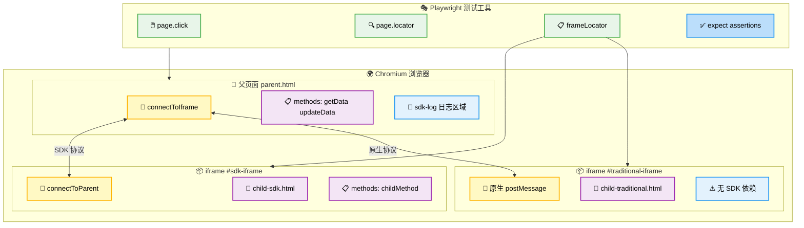
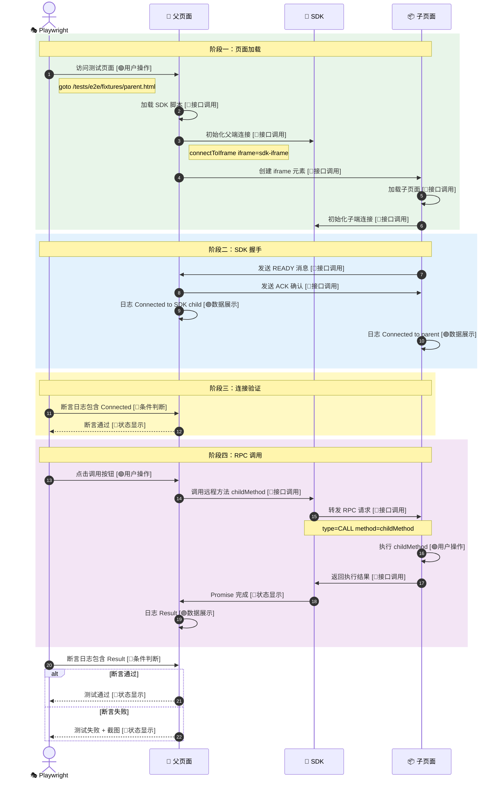
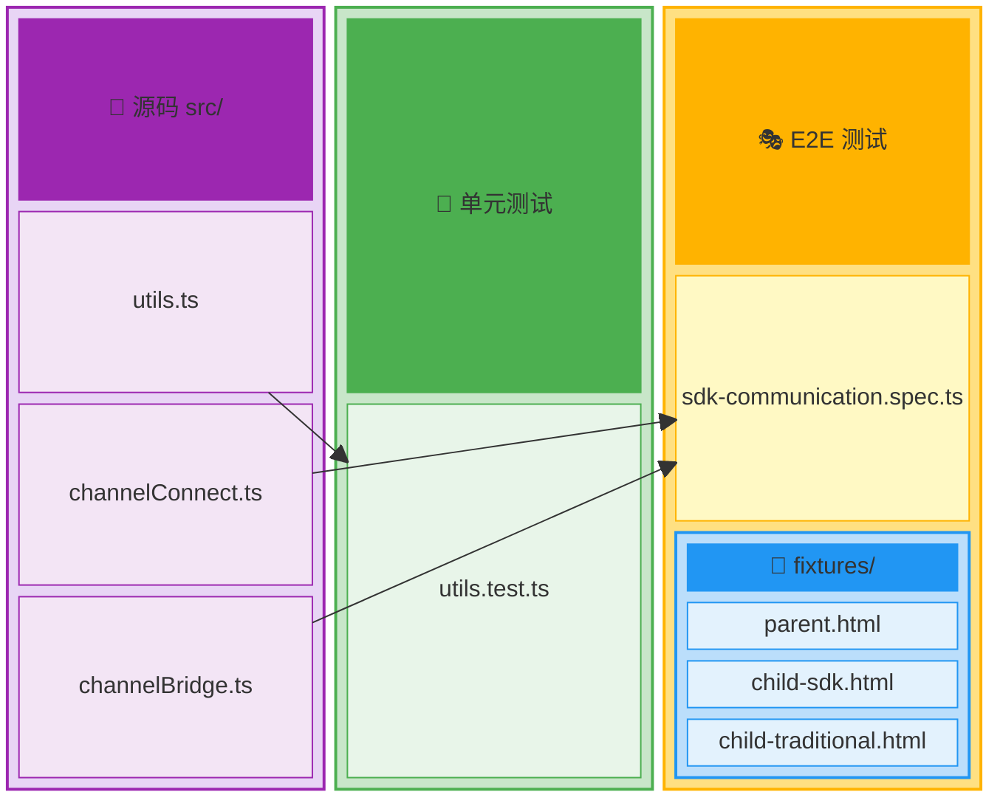
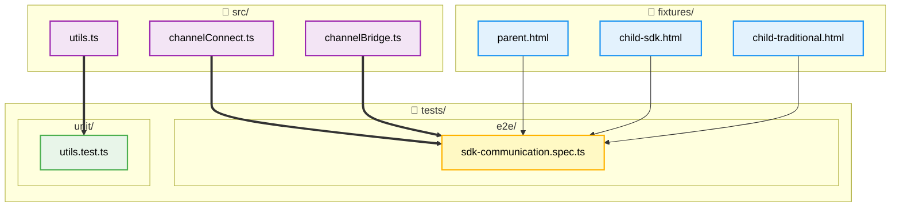
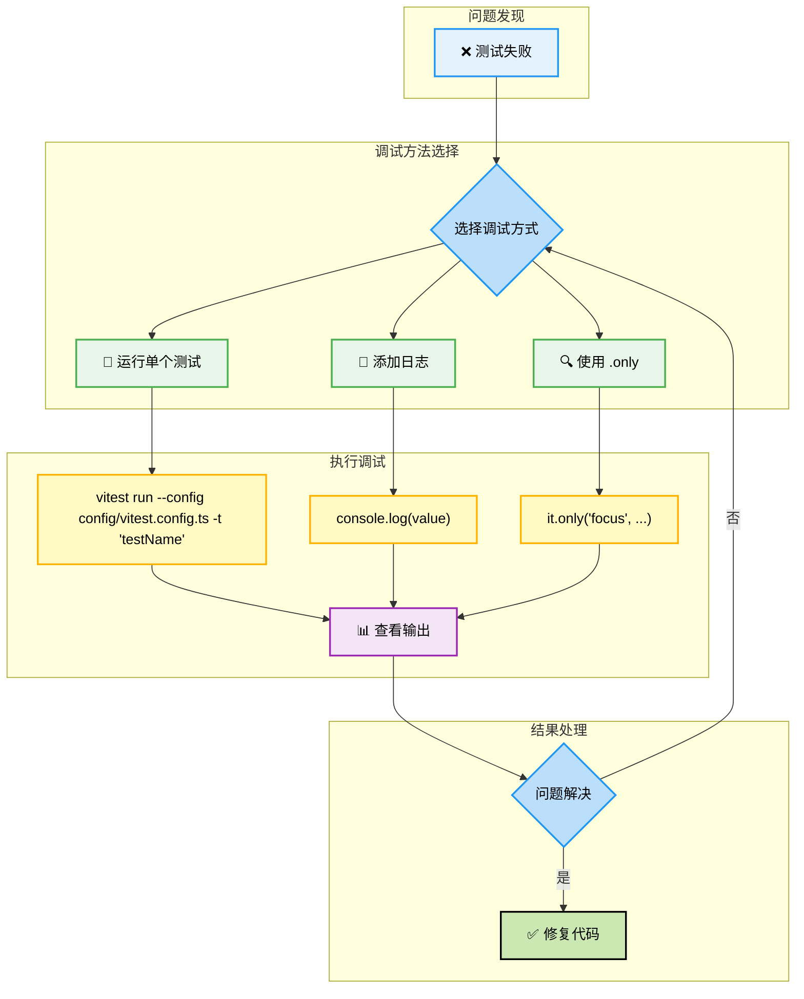
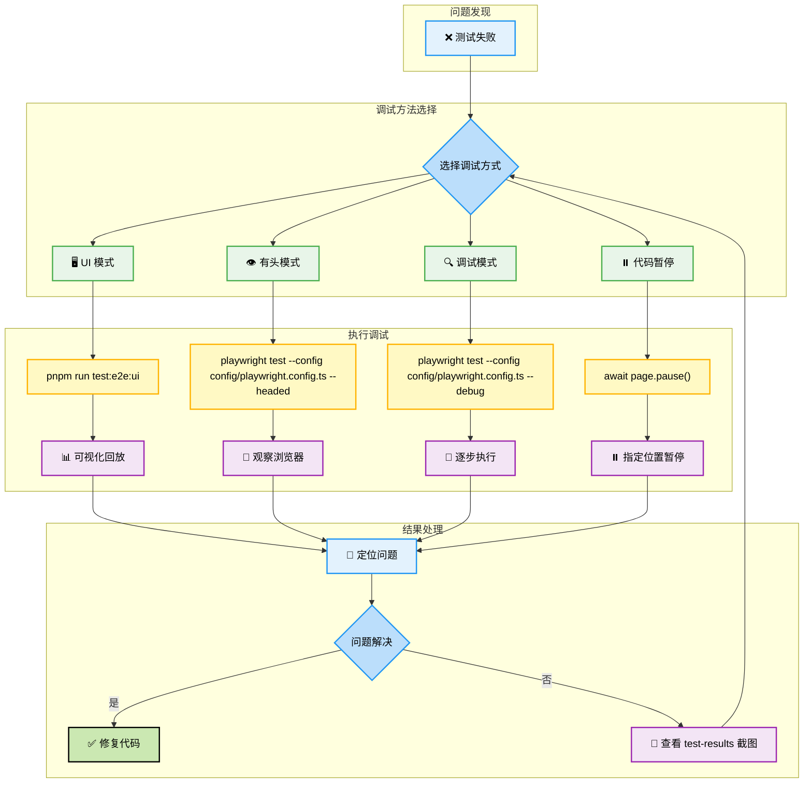

# 测试工作流程 v3

结合分层结构 + 标准配色 + 高级时序图特性的最终版本。

---

## 单元测试流程（Vitest + happy-dom）

### 整体执行流程

### 单元测试数据流时序

---

## E2E 测试流程（Playwright + Chromium）

### 整体执行流程

### E2E 页面架构

### SDK 通信时序

---

## 测试文件映射关系

### 方案 A：表格形式（最简洁）

| 源文件 | 类型 | 单元测试 | E2E 测试 |
|-------|------|---------|---------|
| `src/utils.ts` | 工具函数 | `tests/unit/utils.test.ts` | - |
| `src/channelConnect.ts` | 连接逻辑 | - | `tests/e2e/sdk-communication.spec.ts` |
| `src/channelBridge.ts` | 消息桥接 | - | `tests/e2e/sdk-communication.spec.ts` |

**E2E 测试页面：**
| 页面 | 用途 | 加载的源码 |
|-----|------|----------|
| `fixtures/parent.html` | 父页面 | `channelConnect.ts` |
| `fixtures/child-sdk.html` | SDK 子页面 | `channelConnect.ts` |
| `fixtures/child-traditional.html` | 原生子页面 | 无 SDK |

---

### 方案 B：Block Diagram（展示层次）

---

### 方案 C：Flowchart TB（展示依赖流向）

---

### 方案对比

| 方案 | 优点 | 缺点 | 适用场景 |
|-----|------|------|---------|
| **A 表格** | 最简洁，信息密度高 | 无法展示复杂关系 | 快速查阅 |
| **B Block** | 层次清晰，结构化 | 依赖关系不明显 | 展示目录结构 |
| **C Flowchart** | 依赖流向清晰 | 占用空间大 | 展示数据流 |

---

## 调试流程

### 单元测试调试

### E2E 测试调试

---

## 配色图例

| 节点类型 | 颜色 | Emoji | 含义 |
|---------|------|-------|------|
| 开始/结束 | `#CBE8B2` | 🚀 📝 | 流程边界 |
| 命令/调用 | `#FFF9C4` | ⚙️ 🔨 🔌 | 系统命令、API 调用 |
| 数据/配置 | `#F3E5F5` | 📄 📦 📋 | 文件、配置、数据 |
| 用户操作 | `#E8F5E9` | 🖱️ 🧪 🎯 | 测试操作、交互 |
| 状态反馈 | `#E3F2FD` | ✅ ❌ 🤝 | 日志、状态、结果 |
| 条件判断 | `#BBDEFB` | ❓ | 分支、断言 |

---

*v3.0 - 结合分层结构 + 标准配色 + 高级时序图特性*
